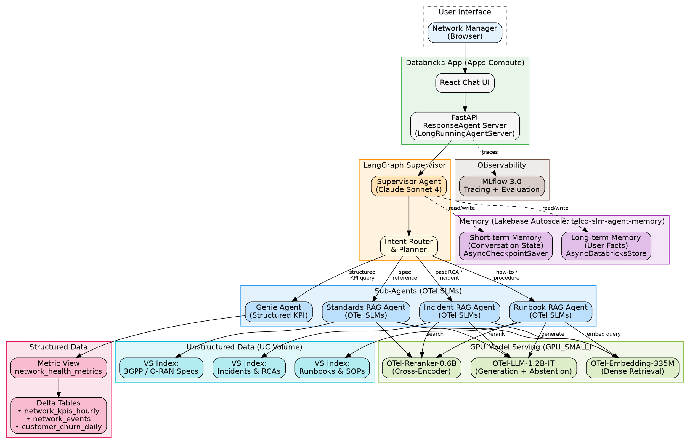

# OTel SLM Agent Demo — Design Document

**Author:** Max Carduner
**Date:** June 23, 2026
**Workspace:** fevm-cmegdemos
**Catalog/Schema:** `cmegdemos_catalog`.`network_analytics_enablement`

---

## 1. Objective

Demonstrate an agentic network operations assistant ("Telco GPT") that combines live network KPI data with telco-domain RAG — powered by Open Telco (OTel) Small Language Models for sub-domain retrieval/generation and a frontier model as the supervisor orchestrator.

**Key differentiators for the demo:**
- OTel SLMs handle all RAG (embedding, reranking, generation) across multiple sub-domain Vector Search indexes — cost-efficient, low-latency, telco-optimized
- Frontier model (Claude Sonnet 4 via `databricks-claude-sonnet-4`) serves as the LangGraph supervisor for routing, planning, and final synthesis
- Metric Views define KPIs consistently, queried via a single Genie Space
- LangGraph orchestration wrapped in Databricks ResponseAgent framework
- Long-term + short-term memory via Lakebase
- Deployed on Databricks Apps compute

---

## 2. Architecture

### High-Level Flow

```
┌───────────────────────────────────────────────────────────────────────────────┐
│                            DATABRICKS APP (Apps Compute)                       │
│                   React Chat UI + FastAPI (ResponseAgent Server)               │
└──────────────────────────────────┬────────────────────────────────────────────┘
                                   │
                                   v
┌───────────────────────────────────────────────────────────────────────────────┐
│                        LANGGRAPH SUPERVISOR AGENT                              │
│                     (Frontier Model — Claude Sonnet 4)                         │
│                                                                               │
│   Responsibilities:                                                           │
│   • Intent classification & routing                                           │
│   • Multi-step planning (UC1→UC2→UC3 flows)                                  │
│   • Final answer synthesis from sub-agent results                             │
│   • Conversation management                                                   │
│                                                                               │
│   Memory:                                                                     │
│   ┌─────────────────────┐  ┌─────────────────────────┐                       │
│   │ Short-term Memory   │  │  Long-term Memory        │                       │
│   │ (Thread/Session via │  │  (User facts/prefs via   │                       │
│   │  LangGraph state)   │  │   Lakebase PostgreSQL)   │                       │
│   └─────────────────────┘  └─────────────────────────┘                       │
└─────┬──────────────┬──────────────┬──────────────────┬────────────────────────┘
      │              │              │                  │
      v              v              v                  v
┌───────────┐ ┌───────────┐ ┌───────────┐    ┌──────────────────┐
│ Genie     │ │ Runbook   │ │ Standards │    │ Incident/RCA     │
│ Agent     │ │ RAG Agent │ │ RAG Agent │    │ RAG Agent        │
│ (KPI SQL) │ │ (SLM)     │ │ (SLM)     │    │ (SLM)            │
└─────┬─────┘ └─────┬─────┘ └─────┬─────┘    └────────┬─────────┘
      │              │              │                   │
      v              v              v                   v
┌───────────┐ ┌───────────┐ ┌───────────┐    ┌──────────────────┐
│ Metric    │ │ VS Index: │ │ VS Index: │    │ VS Index:        │
│ View      │ │ Runbooks  │ │ 3GPP/ORAN │    │ Incidents        │
│ (KPI      │ │ & SOPs    │ │ Specs     │    │ & Post-Mortems   │
│ Defns)    │ │           │ │           │    │                  │
└───────────┘ └───────────┘ └───────────┘    └──────────────────┘
      │
      v
┌───────────────────────────────────┐
│  Delta Tables (KPI Data)          │
│  cmegdemos_catalog.               │
│  network_analytics_enablement     │
└───────────────────────────────────┘
```

### Component Summary

| Layer | Component | Service | Model/Config |
|-------|-----------|---------|--------------|
| UI | Chat Interface | Databricks App (React + FastAPI) | — |
| Orchestration | Supervisor Agent | LangGraph + ResponseAgent | Claude Sonnet 4 (`databricks-claude-sonnet-4`) |
| Memory (Short) | Conversation state | LangGraph AsyncCheckpointSaver | Lakebase Autoscale: `telco-slm-agent-memory` |
| Memory (Long) | User facts & preferences | AsyncDatabricksStore | Lakebase Autoscale: `telco-slm-agent-memory` |
| Structured Query | KPI Retrieval | Genie Space | Metric View → Delta tables |
| RAG (Runbooks) | Sub-domain retrieval | Vector Search + GPU Serving | OTel-Embedding-335M + OTel-Reranker-0.6B + OTel-LLM-1.2B-IT |
| RAG (Standards) | Sub-domain retrieval | Vector Search + GPU Serving | Same OTel stack |
| RAG (Incidents) | Sub-domain retrieval | Vector Search + GPU Serving | Same OTel stack |
| Embedding | Chunk vectorization | Model Serving (GPU_SMALL) | OTel-Embedding-335M (HF: farbodtavakkoli) |
| Reranking | Cross-encoder scoring | Model Serving (GPU_SMALL) | OTel-Reranker-0.6B |
| Generation (sub-agents) | Domain-grounded answers | Model Serving (GPU_SMALL) | OTel-LLM-1.2B-IT (abstention-trained) |
| Observability | Tracing & Evaluation | MLflow 3.0 | Custom telco scorers |

---

## 3. Data Requirements (Synthetic)

Since this is a demo, we generate synthetic data stored in `cmegdemos_catalog`.`network_analytics_enablement`.

### 3.1 Structured: Network KPI Tables

**Table: `network_kpis_hourly`**

| Column | Type | Description |
|--------|------|-------------|
| timestamp | TIMESTAMP | Hourly observation time |
| region | STRING | Market/region (e.g. "Pacific Northwest", "Southern California") |
| site_id | STRING | Cell site identifier |
| coverage_pct | DOUBLE | Coverage percentage (target: >98%) |
| throughput_mbps | DOUBLE | Avg downlink throughput |
| latency_ms | DOUBLE | Avg RAN latency |
| dropped_call_rate | DOUBLE | % of dropped calls |
| handover_success_rate | DOUBLE | % successful handovers |
| attach_success_rate | DOUBLE | % successful network attaches |
| volte_mos | DOUBLE | VoLTE Mean Opinion Score (1-5) |

**Table: `network_events`**

| Column | Type | Description |
|--------|------|-------------|
| event_id | STRING | Unique event ID |
| timestamp | TIMESTAMP | Event time |
| site_id | STRING | Affected site |
| region | STRING | Market/region |
| event_type | STRING | ALARM, MAINTENANCE, OUTAGE, DEGRADATION |
| severity | STRING | CRITICAL, MAJOR, MINOR, WARNING |
| description | STRING | Event description |
| resolved_at | TIMESTAMP | Resolution time (nullable) |

**Table: `customer_churn_daily`**

| Column | Type | Description |
|--------|------|-------------|
| date | DATE | Observation date |
| region | STRING | Market/region |
| segment | STRING | Consumer, Enterprise, Prepaid |
| churn_rate | DOUBLE | Daily churn rate |
| net_adds | INT | Net subscriber additions |

### 3.2 Metric View: `network_health_metrics`

Defines consistent KPI calculations and thresholds for the Genie Space:

```yaml
# Metric definitions for Genie to query
metrics:
  - name: coverage
    expression: AVG(coverage_pct)
    threshold: 98.0
    unit: "%"

  - name: throughput
    expression: AVG(throughput_mbps)
    threshold: 100.0
    unit: "Mbps"

  - name: latency
    expression: AVG(latency_ms)
    threshold: 20.0
    unit: "ms"
    direction: lower_is_better

  - name: dropped_call_rate
    expression: AVG(dropped_call_rate)
    threshold: 0.5
    unit: "%"
    direction: lower_is_better

  - name: handover_success
    expression: AVG(handover_success_rate)
    threshold: 99.0
    unit: "%"

  - name: volte_quality
    expression: AVG(volte_mos)
    threshold: 4.0
    unit: "MOS"
```

### 3.3 Unstructured: Documents in UC Volume

Store LLM-generated synthetic documents (PDFs) in a UC Volume:

**Volume:** `cmegdemos_catalog`.`network_analytics_enablement`.`telco_docs`

| Sub-folder | Content | Count |
|------------|---------|-------|
| `/runbooks/` | Network troubleshooting procedures, SOPs | ~10 docs |
| `/standards/` | Simulated 3GPP/O-RAN spec excerpts | ~5 docs |
| `/incidents/` | Past RCA reports, post-mortems | ~8 docs |

### 3.4 Document Processing Pipeline

```
UC Volume (PDFs)
    │
    v
ai_parse_document()          ← Serverless extraction of text/tables from PDF
    │
    v
Delta Tables (parsed text)   ← telco_docs_runbooks_parsed, telco_docs_standards_parsed, telco_docs_incidents_parsed
    │
    v
Chunking (512 tok / 64 overlap, section-aware)
    │
    v
Delta Tables (chunks)        ← telco_docs_runbooks_chunks, telco_docs_standards_chunks, telco_docs_incidents_chunks
    │
    v
Vector Search Index (auto-sync from chunk tables, OTel-Embedding-335M)
```

**Key:** `ai_parse_document` extracts structured text from the generated PDFs before chunking. This is the same pattern that would be used with real SharePoint-sourced documents in production.

---

## 4. OTel Model Stack (HuggingFace)

All models are Apache 2.0 licensed, telco-domain optimized:

| Model | HF Repo | Base | VRAM (FP16) | Purpose |
|-------|---------|------|-------------|---------|
| OTel-Embedding-335M | `farbodtavakkoli/OTel-Embedding-335M` | BAAI/bge-large-en-v1.5 | ~0.7 GB | Dense retrieval from VS indexes |
| OTel-Reranker-0.6B | `farbodtavakkoli/OTel-Reranker-0.6B` | Qwen/Qwen3-0.6B | ~1.2 GB | Cross-encoder reranking |
| OTel-LLM-1.2B-IT | `farbodtavakkoli/OTel-LLM-1.2B-IT` | google/gemma-3-1b-it | ~2.4 GB | Generation with abstention |

**Total VRAM:** ~4.3 GB — all fit on a single GPU_SMALL (24 GB) endpoint.

**Why OTel SLMs over frontier for RAG sub-agents:**
- Trained on 326K+ curated telecom samples
- Abstention training (declines when context insufficient vs. hallucinating)
- <100ms latency per call
- Fixed cost (~$301/mo for serving) vs. variable token costs
- Data stays in-workspace

---

## 5. Genie Space Configuration

A single Genie Space handles all structured KPI queries:

**Name:** `Network KPI Explorer`
**Tables:**
- `cmegdemos_catalog`.`network_analytics_enablement`.`network_kpis_hourly`
- `cmegdemos_catalog`.`network_analytics_enablement`.`network_events`
- `cmegdemos_catalog`.`network_analytics_enablement`.`customer_churn_daily`

**Metric View:** `cmegdemos_catalog`.`network_analytics_enablement`.`network_health_metrics`

**Sample instructions for Genie:**
- "When asked about network health, query the metric view for current KPI values vs thresholds"
- "Flag any KPI that is below threshold as degraded"
- "Support time-range filtering (last 24h, last 7d, last 30d)"
- "Support region-level drill-down"

---

## 6. Vector Search Indexes

Three indexes served on the **same VS endpoint** (re-use an existing endpoint if one is already provisioned), all using OTel-Embedding-335M:

| Index Name | Source Table | Content | Sync |
|------------|-------------|---------|------|
| `runbooks_vs_index` | `telco_docs_runbooks_chunks` (parsed + chunked) | Troubleshooting guides, SOPs | Triggered |
| `standards_vs_index` | `telco_docs_standards_chunks` (parsed + chunked) | 3GPP/O-RAN spec excerpts | Triggered |
| `incidents_vs_index` | `telco_docs_incidents_chunks` (parsed + chunked) | Past RCAs, post-mortems | Triggered |

**Chunking strategy:** 512 tokens with 64-token overlap, section-aware splitting.
**Endpoint:** `demo_telco_vs_endpoint` (existing endpoint on CMEG workspace).

---

## 7. LangGraph Agent Design

### Supervisor Graph Structure

```python
# Simplified graph topology
supervisor_graph = StateGraph(AgentState)

# Nodes
supervisor_graph.add_node("supervisor", supervisor_node)      # Frontier model
supervisor_graph.add_node("genie_agent", genie_kpi_node)      # Structured KPI
supervisor_graph.add_node("runbook_agent", runbook_rag_node)   # Runbook RAG (OTel)
supervisor_graph.add_node("standards_agent", standards_rag_node) # Standards RAG (OTel)
supervisor_graph.add_node("incident_agent", incident_rag_node)  # Incident RAG (OTel)

# Routing logic in supervisor
# Intent → route to appropriate sub-agent(s)
# May invoke multiple sub-agents for complex queries (e.g., UC2 needs Genie + Incidents)
```

### Sub-Agent RAG Flow (each unstructured agent)

```
User query (from supervisor)
    │
    v
OTel-Embedding-335M → Vector Search (top-k=20)
    │
    v
OTel-Reranker-0.6B → Re-ranked (top-k=5)
    │
    v
OTel-LLM-1.2B-IT → Grounded answer (with citations) OR abstention
    │
    v
Return to supervisor
```

### Memory Architecture

| Type | Implementation | Backing Store | Scope |
|------|---------------|---------------|-------|
| Short-term (conversation) | LangGraph `AsyncCheckpointSaver` | Lakebase Autoscale: `telco-slm-agent-memory` | Per thread/session |
| Long-term (user facts) | `AsyncDatabricksStore` with `get_user_memory` / `save_user_memory` tools | Lakebase Autoscale: `telco-slm-agent-memory` | Cross-session, per user |

---

## 8. Demo Use Cases (Walkthrough)

### UC1: Network Health Summary
**User:** "How is my network today?"
**Flow:** Supervisor → Genie Agent → queries metric view → returns KPI summary with threshold flags
**Expected output:** Table of current KPIs with status (green/red), anomaly highlights

### UC2: Root Cause Analysis
**User:** "What's causing the latency spike in Pacific Northwest?"
**Flow:** Supervisor → [Genie Agent (get latency data + correlated KPIs) + Incident Agent (similar past incidents) + Runbook Agent (relevant troubleshooting docs)] → Supervisor synthesizes RCA
**Expected output:** Proposed root causes with evidence from both live data and historical docs

### UC3: Remediation Guidance
**User:** "How do I fix this?"
**Flow:** Supervisor → [Runbook Agent (SOPs for identified root cause) + Standards Agent (relevant 3GPP procedures)] → Supervisor presents remediation steps
**Expected output:** Step-by-step remediation referencing specific runbook procedures

---

## 9. Implementation Steps

### Phase 1: Data & Infrastructure

| # | Task | Details | Skill |
|---|------|---------|-------|
| 1 | Generate synthetic KPI data | Spark + Faker: 90 days of hourly data across 6 regions, 50 sites; inject anomalies | `databricks-synthetic-data-gen` |
| 2 | Create Delta tables | Write KPI tables to `cmegdemos_catalog`.`network_analytics_enablement` | `databricks-execution-compute` |
| 3 | Generate synthetic documents | LLM-generate ~23 telco docs (runbooks, specs, incidents) as PDFs, upload to UC Volume | `databricks-unstructured-pdf-generation` |
| 4 | Parse documents with `ai_parse_document` | Extract text/tables from generated PDFs → write parsed content to Delta tables | `databricks-ai-functions` |
| 5 | Chunk and embed parsed documents | Split parsed text into chunks (512 tok / 64 overlap), store in chunk tables | `databricks-vector-search` |
| 6 | Create Metric View | Define `network_health_metrics` with consistent KPI definitions | `databricks-metric-views` |
| 7 | Deploy OTel models | Register via MLflow, deploy all 3 on consolidated GPU_SMALL endpoint | `databricks-model-serving` |
| 8 | Create Vector Search indexes | 3 indexes on shared VS endpoint using OTel-Embedding-335M | `databricks-vector-search` |
| 9 | Create Genie Space | Point at KPI tables + metric view, add instructions | `databricks-genie` |
| 10 | Provision Lakebase autoscale project | `telco-slm-agent-memory` for conversation + user memory | `databricks-lakebase-autoscale` |

### Phase 2: Agent Build

| # | Task | Details | Skill |
|---|------|---------|-------|
| 11 | Scaffold app from `agent-langgraph-advanced` template | ResponseAgent + LongRunningAgentServer | `databricks-apps-python` |
| 12 | Implement supervisor node | Claude Sonnet 4 with routing logic | `databricks-model-serving` |
| 13 | Implement Genie sub-agent | Tool that calls Genie Space API | `databricks-genie` |
| 14 | Implement RAG sub-agents (x3) | OTel embed → VS search → rerank → generate pipeline | `databricks-vector-search`, `databricks-model-serving` |
| 15 | Wire memory (short + long term) | Connect Lakebase autoscale `telco-slm-agent-memory` for checkpoints and user store | `databricks-lakebase-autoscale` |
| 16 | Build chat UI | React frontend with streaming support | `databricks-apps-python` |

### Phase 3: Observability & Polish

| # | Task | Details | Skill |
|---|------|---------|-------|
| 17 | Instrument with MLflow Tracing | Trace all agent turns, sub-agent calls, latency | `instrumenting-with-mlflow-tracing` |
| 18 | Build evaluation dataset | 15-20 sample questions covering UC1/UC2/UC3 | `databricks-mlflow-evaluation` |
| 19 | Create custom scorers | Relevance, groundedness, telco-accuracy | `databricks-mlflow-evaluation` |
| 20 | Run evaluation & tune prompts | Iterate on system prompts based on scorer results | `databricks-mlflow-evaluation` |
| 21 | Deploy to Databricks Apps | DAB bundle, serverless, apps compute | `databricks-bundles` |

---

## 10. Deployment (DAB Bundle)

```yaml
bundle:
  name: otel-slm-agent-demo

workspace:
  profile: fevm-cmegdemos

resources:
  apps:
    otel_telco_agent:
      name: "otel-telco-agent"
      source_code_path: ./app
      config:
        - name: DATABRICKS_CONFIG_PROFILE
          value: fevm-cmegdemos
        - name: LAKEBASE_AUTOSCALE_PROJECT
          value: telco-slm-agent-memory
        - name: MLFLOW_EXPERIMENT_ID
          value: /Users/max.carduner/otel-slm-agent-demo
        - name: GENIE_SPACE_ID
          value: "<genie_space_id>"
        - name: FRONTIER_MODEL_ENDPOINT
          value: "databricks-claude-sonnet-4"
        - name: OTEL_EMBEDDING_ENDPOINT
          value: "otel-embedding-335m"
        - name: OTEL_RERANKER_ENDPOINT
          value: "otel-reranker-06b"
        - name: OTEL_LLM_ENDPOINT
          value: "otel-llm-12b-it"

  jobs:
    data_setup:
      name: "otel-demo-data-setup"
      tasks:
        - task_key: generate_kpi_data
          notebook_task:
            notebook_path: ./notebooks/01_generate_kpi_data.py
          environments:
            - environment_key: serverless
              spec:
                client: "5"
                dependencies:
                  - faker
        - task_key: generate_documents
          notebook_task:
            notebook_path: ./notebooks/02_generate_documents.py
          depends_on:
            - task_key: generate_kpi_data
          environments:
            - environment_key: serverless
              spec:
                client: "5"
        - task_key: parse_documents
          notebook_task:
            notebook_path: ./notebooks/03_parse_documents.py
          depends_on:
            - task_key: generate_documents
          environments:
            - environment_key: serverless
              spec:
                client: "5"
        - task_key: create_vs_indexes
          notebook_task:
            notebook_path: ./notebooks/04_create_vs_indexes.py
          depends_on:
            - task_key: parse_documents
          environments:
            - environment_key: serverless
              spec:
                client: "5"
                dependencies:
                  - databricks-vectorsearch
```

---

## 11. Architecture Diagram (Lucid Chart Import)

Below is a DOT-format graph you can import into Lucid Chart:



---

## 12. Decisions (Resolved)

| # | Question | Decision |
|---|----------|----------|
| 1 | Frontier model for supervisor | Claude Sonnet 4 via `databricks-claude-sonnet-4` |
| 2 | Number of VS indexes | 3 indexes (runbooks, standards, incidents) served on the **same VS endpoint** — re-use existing endpoint |
| 3 | Metric View availability | Metric Views are available on CMEG workspace — use them |
| 4 | Document generation approach | LLM-generate realistic telco docs (PDFs), then parse with `ai_parse_document` |
| 5 | Demo scope | Full scope: UC1 + UC2 + UC3 |
| 6 | Lakebase project | Autoscaling project: `telco-slm-agent-memory` |

---

## 13. Success Criteria

- [ ] User can ask "How is my network today?" and get a KPI summary with threshold flags
- [ ] User can ask about a degraded KPI and get a grounded RCA with citations from docs
- [ ] User can ask for remediation and get step-by-step procedures from runbooks
- [ ] OTel SLMs correctly abstain when context is insufficient
- [ ] All interactions are traced end-to-end in MLflow
- [ ] Response latency < 10 seconds for full multi-agent flow
- [ ] Memory persists across sessions (user preferences, past interactions)

---

## 14. Skill Reference (ai-dev-kit)

Skills from [databricks-solutions/ai-dev-kit](https://github.com/databricks-solutions/ai-dev-kit/tree/main/databricks-skills) to invoke for each implementation phase:

| Skill | Used For | Phase |
|-------|----------|-------|
| `databricks-synthetic-data-gen` | Generate realistic KPI data (Spark + Faker, serverless) | 1 |
| `databricks-unstructured-pdf-generation` | LLM-generate telco PDF documents (runbooks, specs, incidents) | 1 |
| `databricks-ai-functions` | `ai_parse_document()` to extract text/tables from PDFs | 1 |
| `databricks-execution-compute` | Run notebooks on serverless compute | 1 |
| `databricks-unity-catalog` | UC Volumes, table creation, permissions | 1 |
| `databricks-metric-views` | Define `network_health_metrics` metric view | 1 |
| `databricks-model-serving` | Deploy OTel models (GPU_SMALL) + frontier model endpoint config | 1, 2 |
| `databricks-vector-search` | Create VS endpoint/indexes, configure auto-sync from chunk tables | 1, 2 |
| `databricks-genie` | Create Genie Space, configure tables + metric view + instructions | 1, 2 |
| `databricks-lakebase-autoscale` | Provision `telco-slm-agent-memory` project for agent memory | 1, 2 |
| `databricks-apps-python` | Scaffold app from `agent-langgraph-advanced`, build React UI | 2 |
| `instrumenting-with-mlflow-tracing` | Add tracing to all agent nodes and sub-agent calls | 3 |
| `databricks-mlflow-evaluation` | Build eval dataset, create scorers, run `mlflow.genai.evaluate()` | 3 |
| `databricks-bundles` | DAB configuration for deployment (serverless jobs, app resource) | 3 |
| `databricks-jobs` | Run data setup job, repair failed tasks | 1, 3 |
